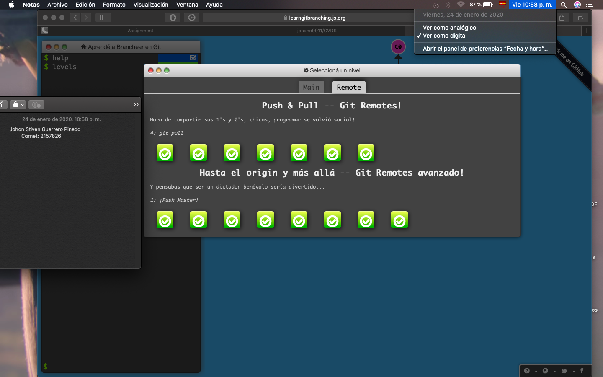

# Johan Stiven Guerrero Pineda
*Edad: 19*
**Fecha de nacimiento: 12/07/00**
## Materias que veo este septimo semestre
* AUPN
* CVDS
* FCFI
* CLYS
* ACSO

## Actividades que hago en mi tiempo libre
1. Jugar futbol
2. Jugar videojuegos
3. Hacer ejercicio
4. Estar con mis amigos
5. Bailar

Colegio al que pertenezco desde que he estado desde sexto,[Instituto san Ignacio de Loyola][1], he vivido cerca de ahi toda mi vida y siempre he crecido con valores y con muchas ganas de innovar y crear una diferencia.

[1]:http://seab.arquibogota.org.co/es/noticias/18114-instituto-san-ignacio-de-loyola.html\

